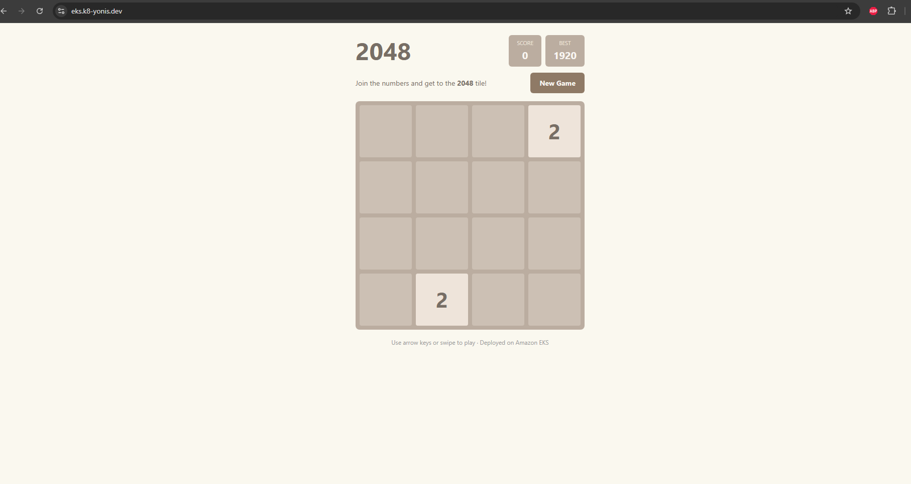
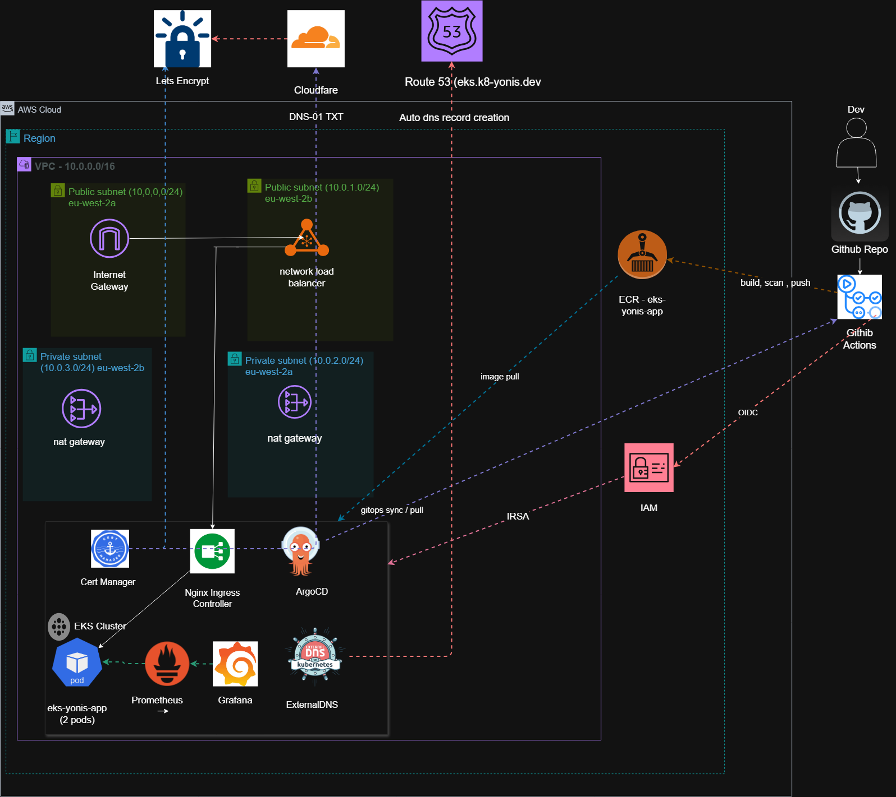
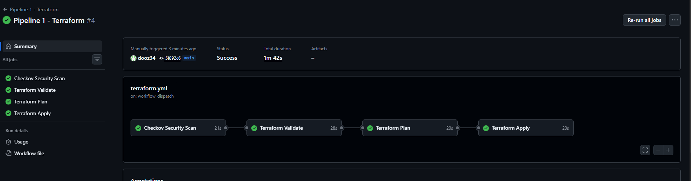
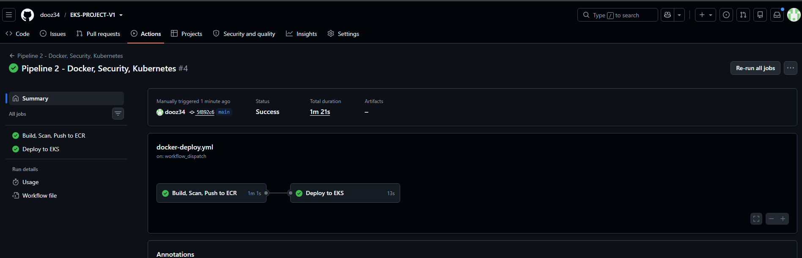

# EKS Project — Secure Cloud-Native App on Amazon EKS

Deploys a containerized app to Amazon EKS with GitOps (ArgoCD), automatic
HTTPS (NGINX Ingress + CertManager), dynamic DNS (ExternalDNS + Route 53),
CI/CD (GitHub Actions), and monitoring (Prometheus + Grafana).

**Live at:** `https://eks.k8-yonis.dev`

## Live Application


## Status — complete

- [x] Terraform: VPC (public/private subnets across 2 AZs), remote state (S3 + DynamoDB)
- [x] Terraform: EKS cluster (Kubernetes 1.32) + managed node group (private subnets)
- [x] Terraform: IAM roles for cluster, nodes, and IRSA (ExternalDNS, CertManager)
- [x] Terraform: ECR repository, dedicated Route 53 hosted zone
- [x] NGINX Ingress Controller (Helm, AWS NLB)
- [x] CertManager (Let's Encrypt production, Route 53 DNS-01 challenge)
- [x] ExternalDNS (auto-manages Route 53 records for the Ingress)
- [x] App deployed (2 replicas, custom-built game, containerized)
- [x] CI/CD Pipeline 1: Terraform validate/plan/apply + Checkov security scan
- [x] CI/CD Pipeline 2: Docker build, Trivy scan, push to ECR, GitOps manifest update
- [x] ArgoCD GitOps (auto-syncs cluster state from this repo)
- [x] Prometheus + Grafana (cluster metrics, pod health, node status, Ingress traffic dashboards)
- [x] Architecture diagram (`docs/architecture.png`)

## Architecture



## CI/CD Pipeline Runs

**Pipeline 1 — Terraform + Checkov:**


**Pipeline 2 — Docker, Trivy, Deploy to EKS:**


## Project Structure
EKS-PROJECT-V1/
├── .github/
│ └── workflows/
│ ├── terraform.yml (Pipeline 1: Checkov → Validate → Plan → Apply)
│ └── docker-deploy.yml (Pipeline 2: Build → Trivy → Push to ECR → Update Manifest)
├── app/
│ ├── index.html
│ ├── script.js
│ ├── style.css
│ └── Dockerfile
├── docs/
│ ├── architecture.png
│ ├── bootstrap-backend.md
│ └── images/
│ ├── pipeline1-terraform-success.png
│ └── pipeline2-docker-deploy-success.png
├── k8s/
│ ├── argocd/
│ │ └── app.yaml (ArgoCD Application — watches k8s/base/)
│ └── base/
│ ├── app-deployment.yaml (Deployment + Service)
│ ├── app-ingress.yaml (Ingress + TLS + ExternalDNS annotations)
│ ├── cluster-issuer.yaml (Let's Encrypt ClusterIssuer)
│ ├── ingress-nginx-values.yaml
│ └── monitoring-values.yaml
├── terraform/
│ ├── environments/
│ │ └── prod/
│ │ ├── backend.tf (S3 + DynamoDB remote state)
│ │ ├── main.tf (wires VPC + EKS + IRSA + ECR)
│ │ ├── outputs.tf
│ │ ├── providers.tf
│ │ └── variables.tf
│ └── modules/
│ ├── eks/ (cluster, node group, IAM roles, OIDC)
│ ├── irsa/ (reusable IAM role ← k8s service account)
│ └── vpc/ (VPC, public/private subnets, NAT)
├── .gitignore
└── README.md

## Getting started (redeploying from scratch)

1. **Bootstrap remote state** — see `docs/bootstrap-backend.md`. Do this once, manually, before `terraform init`.
2. **Deploy infrastructure**:
```bash
   cd terraform/environments/prod
   terraform init
   terraform plan
   terraform apply
```
3. **Configure kubectl** and grant yourself cluster access:
```bash
   aws eks update-kubeconfig --name eks-yonis-prod --region eu-west-2

   aws eks create-access-entry --cluster-name eks-yonis-prod --region eu-west-2 \
     --principal-arn <your-iam-user-or-role-arn>
   aws eks associate-access-policy --cluster-name eks-yonis-prod --region eu-west-2 \
     --principal-arn <your-iam-user-or-role-arn> \
     --policy-arn arn:aws:eks::aws:cluster-access-policy/AmazonEKSClusterAdminPolicy \
     --access-scope type=cluster
```
4. **Install the platform layer** (Helm):
```bash
   helm repo add ingress-nginx https://kubernetes.github.io/ingress-nginx
   helm repo add jetstack https://charts.jetstack.io
   helm repo add external-dns https://kubernetes-sigs.github.io/external-dns/
   helm repo add prometheus-community https://prometheus-community.github.io/helm-charts
   helm repo update

   helm install ingress-nginx ingress-nginx/ingress-nginx \
     --namespace ingress-nginx --create-namespace -f k8s/base/ingress-nginx-values.yaml

   helm install cert-manager jetstack/cert-manager \
     --namespace cert-manager --create-namespace --set installCRDs=true \
     --set "serviceAccount.annotations.eks\.amazonaws\.com/role-arn=$(terraform -chdir=terraform/environments/prod output -raw cert_manager_role_arn)"

   helm install external-dns external-dns/external-dns \
     --namespace external-dns --create-namespace \
     --set provider=aws --set aws.zoneType=public \
     --set "serviceAccount.annotations.eks\.amazonaws\.com/role-arn=$(terraform -chdir=terraform/environments/prod output -raw external_dns_role_arn)" \
     --set txtOwnerId=eks-yonis-prod --set domainFilters[0]=eks.k8-yonis.dev --set policy=sync

   kubectl create namespace argocd
   kubectl apply -n argocd -f https://raw.githubusercontent.com/argoproj/argo-cd/stable/manifests/install.yaml

   helm install monitoring prometheus-community/kube-prometheus-stack \
     --namespace monitoring --create-namespace --set grafana.adminPassword=admin123
```
5. **Deploy the app**:
```bash
   kubectl apply -f k8s/base/cluster-issuer.yaml
   kubectl apply -f k8s/base/app-deployment.yaml
   kubectl apply -f k8s/base/app-ingress.yaml
   kubectl apply -f k8s/argocd/app.yaml
```
6. **Grant GitHub Actions cluster access** (for the CI/CD pipelines):
```bash
   aws eks create-access-entry --cluster-name eks-yonis-prod --region eu-west-2 \
     --principal-arn arn:aws:iam::<account-id>:role/eks-project-github-actions
   aws eks associate-access-policy --cluster-name eks-yonis-prod --region eu-west-2 \
     --principal-arn arn:aws:iam::<account-id>:role/eks-project-github-actions \
     --policy-arn arn:aws:eks::aws:cluster-access-policy/AmazonEKSClusterAdminPolicy \
     --access-scope type=cluster
```

## Notes on IAM / IRSA / OIDC

`ExternalDNS` and `CertManager` don't use static AWS access keys. Each gets a
dedicated IAM role, scoped only to the specific Route 53 hosted zone, that can
only be assumed by its matching Kubernetes service account (via the EKS OIDC
provider). GitHub Actions authenticates the same way — via OIDC federation to
a dedicated IAM role, no long-lived secrets stored in GitHub.

Worker nodes run in **private subnets only**; the public subnets exist purely
for the internet gateway / load balancer.